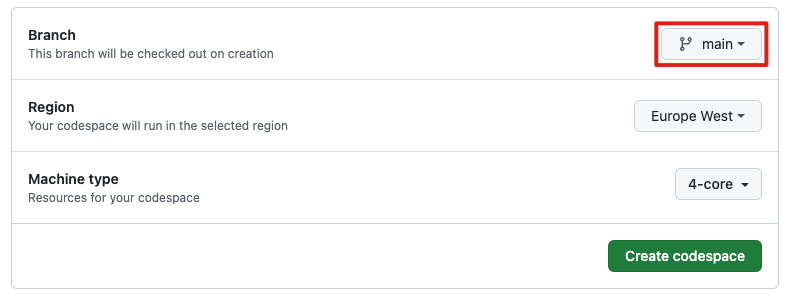
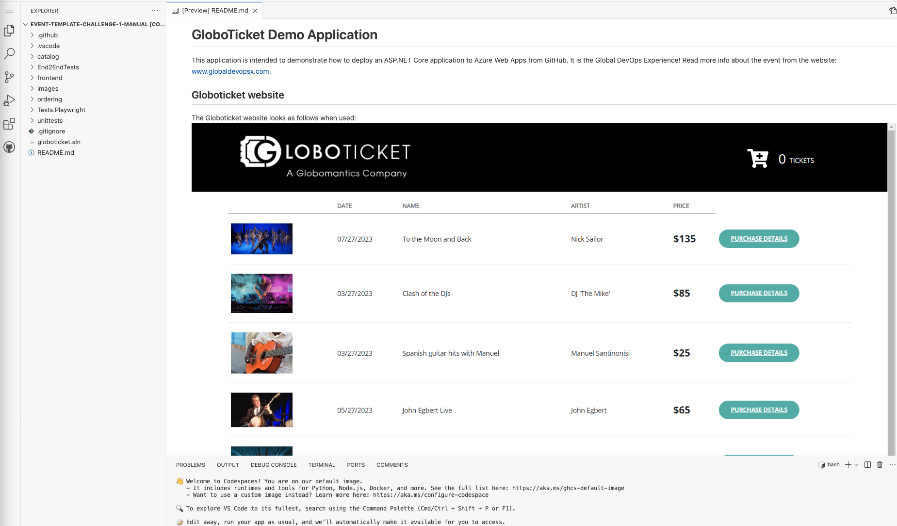
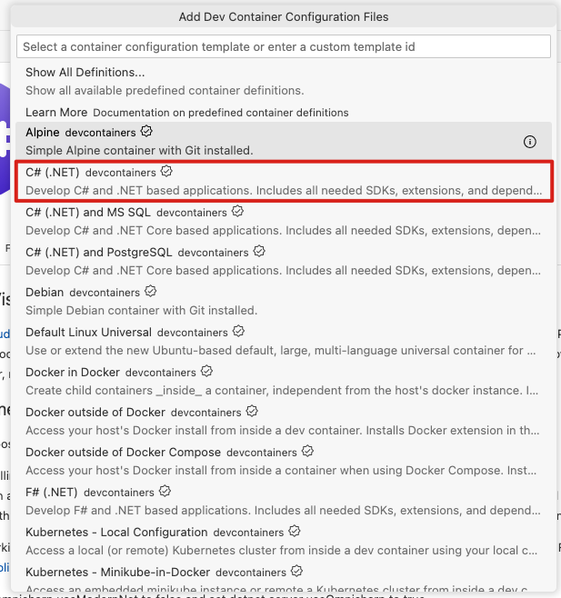

# 挑戰 1 - 步驟指南

## 介紹
作為 Globoticket 的開發團隊，確保所有團隊成員擁有一致且高效的開發環境至關重要。設置標準化的工作空間可以通過提供預配置所有必要工具和擴展的雲端開發環境來實現這一目標。本指南將帶您完成創建、配置和維護能夠運行 C# 程式碼的工作空間的步驟，確保每個開發人員都擁有相同的設置。這將最小化設置時間，減少配置錯誤，並讓團隊專注於構建和改進應用程序。

## 先決條件
在開始之前，請確保您具備以下先決條件：
1. **GitHub 帳戶**：確保您擁有一個有效的 GitHub 帳戶，並有權訪問您希望設置工作空間的存儲庫。
2. **存儲庫訪問權限**：您應具有創建和修改存儲庫中文件的必要權限（至少是寫入權限）。
3. **啟用 GitHub Codespaces**：確保 GitHub Codespaces 已為您的 GitHub 組織或個人帳戶啟用。這可能需要管理權限。
4. **Visual Studio Code**：儘管您可以直接在工作空間中工作，但本地安裝 Visual Studio Code 可能會有助於進一步配置和使用便利。
5. **瀏覽器相容性**：一個現代網頁瀏覽器（如 Chrome、Firefox 或 Edge），支持 GitHub Codespaces。
6. **基本的 Git 知識**：熟悉基本的 Git 命令和工作流程，以提交和推送變更到存儲庫。
7. **基本的 C# 和 VSCode 知識**：了解 C# 編程和如何在 Visual Studio Code 中導航和使用進行開發。
8. **計費信息**：如果使用 GitHub Codespaces 會產生費用，請確保您已在 GitHub 帳戶或組織中設置必要的計費信息。

## 創建一個空白的工作空間
首先，我們需要設置一個空白的工作空間。這很簡單，只需按照以下步驟進行：

從代碼標籤中點擊按鈕 "code"，然後點擊三個點，選擇 "New with options..." 選項

探索此處的所有選項。

1. **選擇一個分支**：確保選擇要創建工作空間的分支。

2. **選擇您的地區**：選擇最合適的地區（最合理的選擇是離您最近的地區）。

3. **探索機器類型**：我們已經為您選擇了合適的大小並禁用了其他選項，但請注意在您自己的環境中有更大的機器類型可供選擇。

4. **點擊創建工作空間**：點擊按鈕創建工作空間。

5. **工作空間正在啟動**：您的瀏覽器將導航到工作空間（第一次可能需要一段時間）。

6. **安裝擴展**：打開擴展標籤並開始添加所需的擴展：

作為 Globoticket 的開發團隊，我們需要以下擴展：

- C#
- C# DevKit
- GitHub Actions
- REST Client

通過瀏覽擴展標籤，您可以安裝這些插件。

**C# & C# DevKit**：

**GitHub Actions**：

**Rest Client**：

安裝所有擴展後，導航到擴展標籤並將篩選器設置為已啟用：

從 C# 開始並右鍵單擊：

您會看到此提示：

點擊 "Add files" 並會打開一個下拉菜單，選擇 C# (.NET) devcontainer：

選擇 .NET 版本 6.0：

選擇額外功能並輸入 azure cli，選擇 azure cli 容器並按確定：

選擇 dotnet 並按確定：

選擇 github cli 並按確定：

選擇 powershell 並按確定：

選擇 node 並按確定：

選擇 "keep defaults"：

然後會為您生成這個 devcontainer.json 文件

以相同的方式添加所有擴展，右鍵單擊並添加到 devcontainer.json，當您全部添加後，您的文件應如下所示：

將這部分 devcontainer 從這種情況更改：

至此：

## 確保存儲庫中的代碼運行
1. 通過運行應用程序進行檢查。按 `F5` 並確保所有應用程序啟動。
2. 如果沒有，請更改 VSCode 中的啟動設置。
3. 檢查您的應用程序是否支持斷點調試。
4. 如果一切正常，應用程序會在瀏覽器中的 `localhost:XXXX` 地址運行並進行測試。

## 提交 devcontainer.json 並重建容器
確保您提交該文件。畢竟，您仍處於本地開發環境中，您需要推送到存儲庫。

### 網頁編輯器和工作空間的區別
- **網頁編輯器（.）**：網頁編輯器是完全在瀏覽器中運行的 Visual Studio Code 的輕量級版本。非常適合快速編輯和代碼瀏覽。
- **工作空間**：工作空間是一個完全成熟的雲端開發環境。它包括 Visual Studio Code 的所有功能，加上運行和調試代碼、安裝擴展等的能力。

## 總結
- 設置能夠運行 C# 的基本工作空間環境。
- 安裝指定的擴展以增強開發能力。
- 配置工作空間以支持斷點調試。
- 確保啟用並測試端口轉發，以允許在瀏覽器中運行應用程序。
- 將工作空間配置提交到主存儲庫，以標準化新工作空間的開發環境。
