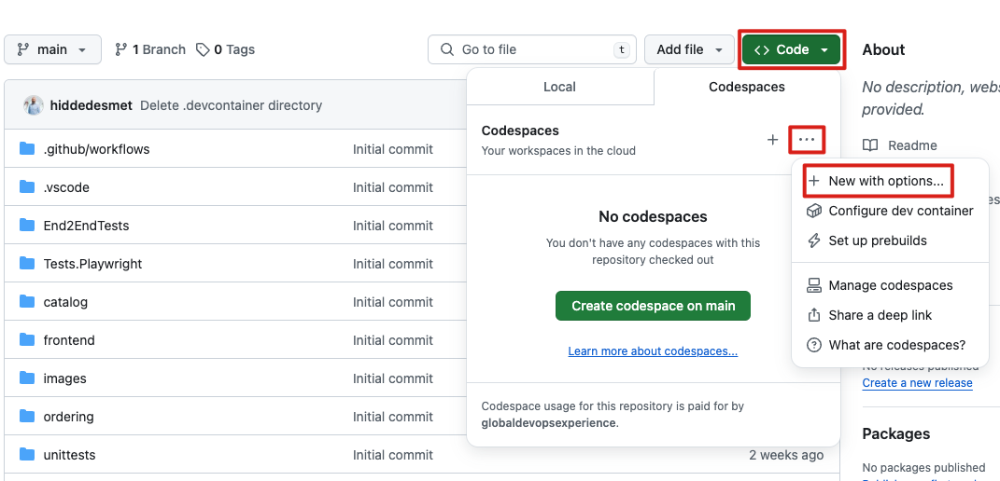
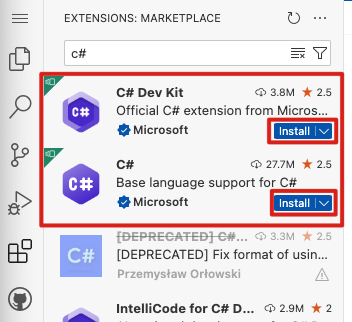
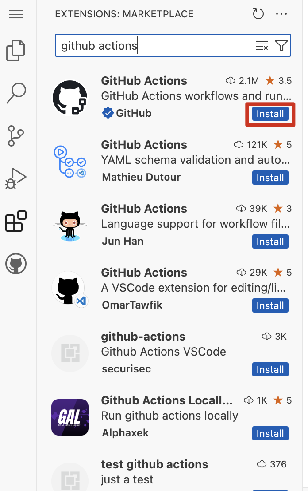
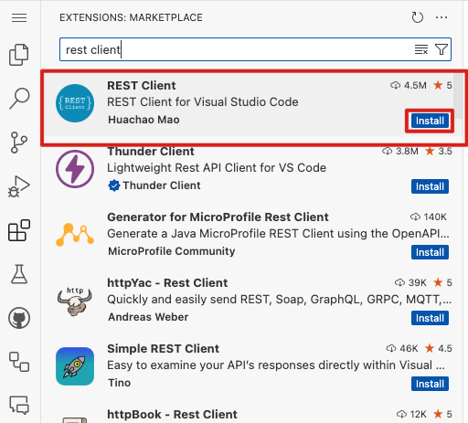
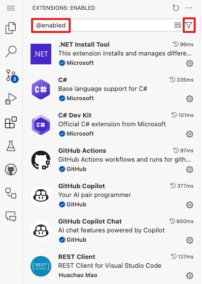
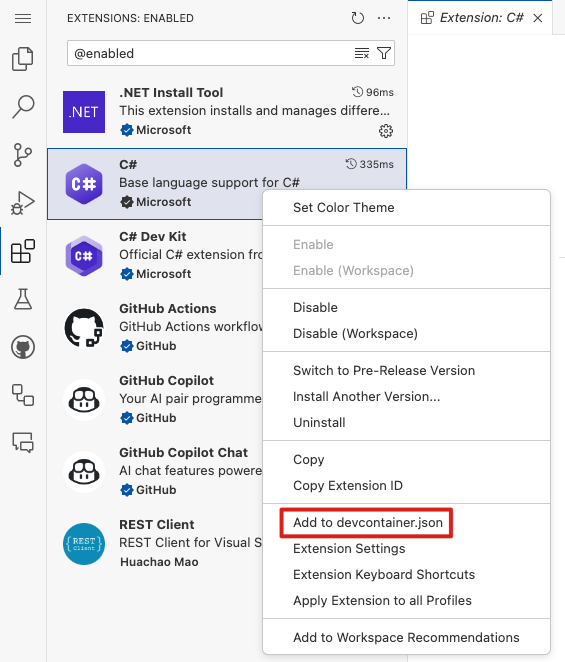
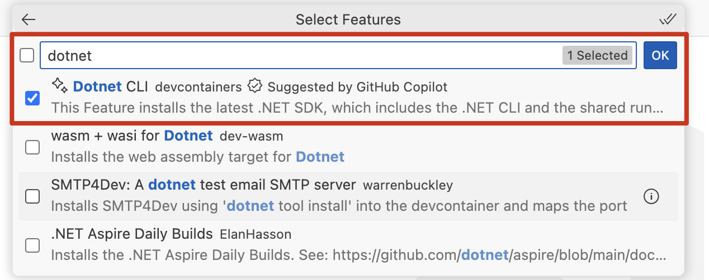
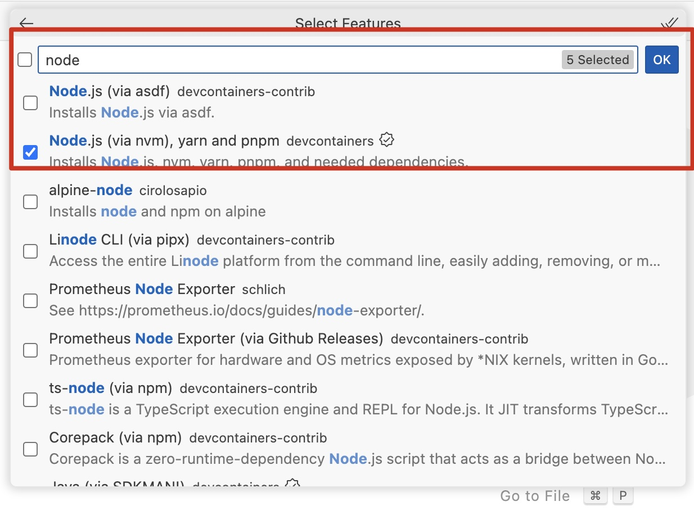
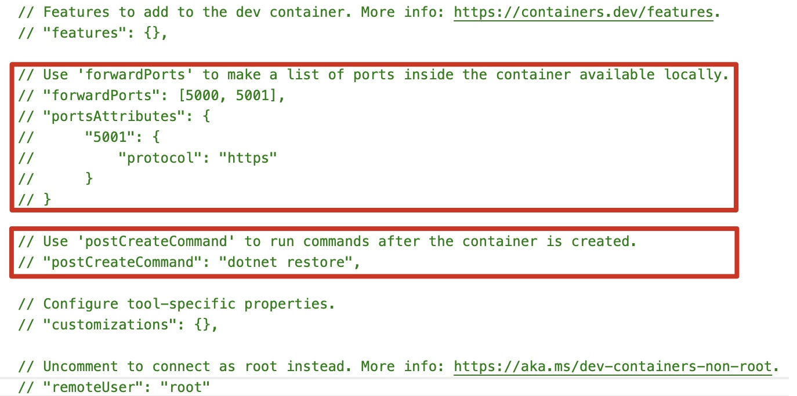

# Challenge 1 - Step - by - Step

## Introduction
As a development team at Globoticket, it's crucial to ensure a consistent and efficient development environment for all team members. Setting up a standardized codespace helps achieve this by providing a cloud-based development environment pre-configured with all necessary tools and extensions. This guide will walk you through the steps to create, configure, and maintain a codespace that can run C# code, ensuring every developer has the same setup. This minimizes setup time, reduces configuration errors, and allows the team to focus on building and improving the application.

## Prerequisites
Before you start, make sure you have the following prerequisites:
1. **GitHub account**: Ensure you have an active GitHub account with access to the repository where you want to set up the codespace.
2. **Repository access**: You should have the necessary permissions (at least write access) to create and modify files in the repository.
3. **GitHub Codespaces enabled**: Make sure GitHub Codespaces is enabled for your GitHub organization or personal account. This may require administrative permissions.
4. **Visual Studio Code**: Although you can work directly in the codespace, having Visual Studio Code installed locally can be helpful for additional configurations and ease of use.
5. **Browser compatibility**: A modern web browser (like Chrome, Firefox, or Edge) that supports GitHub Codespaces.
6. **Basic knowledge of Git**: Familiarity with basic Git commands and workflows to commit and push changes to the repository.
7. **Basic understanding of C# and VSCode**: Knowledge of C# programming and how to navigate and use Visual Studio Code for development.
8. **Billing information**: If using GitHub Codespaces incurs costs, ensure you have set up the necessary billing information in your GitHub account or organization.

## Creating a Blank Codespace
First, we need to set up a blank codespace. This is simple. Just follow along:

From the code tab click on the button code and then click on the thee dots and choose the option "New with options..." 

Explore all options you see here.

1. **Choose a branch**: Ensure you pick the branch where you want to create the codespace.

2. **Choose your region**: Select the most appropriate region. (most logical option is the nearest to your location)

3. **Explore the machine types**: We already picked the right size for you and disabled the other options, but be aware that in your own environment there are bigger machine types to choose.

4. **Click create codespace**: Click the button to create the codespace.

5. **Codespace is starting**: Your browser will navigate to the codespace(first time this can take a while)

6. **Install extensions**: Open the extensions tab and start adding the required extensions:

As a dev team in Globoticket, we need the following extensions:

- C#
- C# DevKit
- GitHub Actions
- REST Client

By browsing to the extensions tab, you can install these plugins. 

**C# & C# DevKit**:

**GitHub Actions**:

**Rest Client**:

When you installed all extensions, navigate to the extensions tab and set the filter to enabled:

Start with C# and press right mouse click:

You will get this prompt:

Click add files and this will open a dropdown menu from above, select C# (.NET) devcontainer:

Select .NET Version 6.0:

Select additional features and type azure cli, select the azure cli container and press ok:

Select dotnet and press ok:

Select github cli and press ok:

Select powershell and press ok:

Select node and press ok:

Select keep defaults:

Then this devcontainer.json file is generated for you

Add all extensions on the same way, so press right mouse click and add to devcontainer.json, when you have added them all your file should look like this:

Change this part of the devcontainer from this situation: 

To this:

## Make sure the code from the repo is running
1. Check by running the application. Press `F5` and make sure that all applications start. 
2. If not, change the launch settings in VSCode.
3. Check if your application works with breakpoints.
4. If everything is well, the application runs in a web browser on a `localhost:XXXX` address and you can run and test it.

## Commit the devcontainer.json and rebuild the container
Make sure you commit the file. Because after all, you are still in a local development environment and you need to push to the repo.

### Difference between the web editor and a codespace
- **Web Editor (.):** The web editor is a lightweight version of Visual Studio Code that runs entirely in your browser. It's great for quick edits and code browsing.
- **Codespace:** A codespace is a full-fledged development environment that runs in the cloud. It includes all the features of Visual Studio Code, plus the ability to run and debug your code, install extensions, and more.

## Summary
- Set up a base codespace environment capable of running C#.
- Install the specified extensions to enhance development capabilities.
- Configure the codespace to enable debugging with support for breakpoints.
- Ensure port forwarding is enabled and tested to allow in-browser application runs.
- Commit the codespace configuration to the main repository to standardize the development environment across new codespaces.
