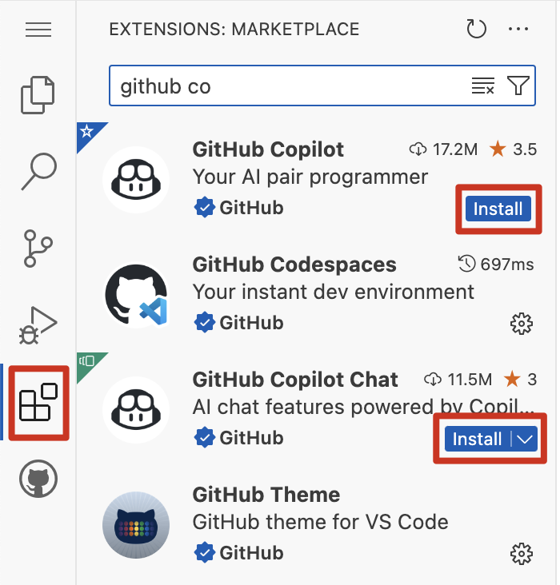

# 挑戰 3 - 步驟指南

## 1. 啟用 GitHub Copilot
在 Visual Studio Code 中安裝 GitHub Copilot。

1. 打開 Visual Studio Code
2. 點擊左側邊欄的擴展圖標
3. 在搜索欄中搜索 "GitHub Copilot"（https://marketplace.visualstudio.com/items?itemName=GitHub.copilot）
4. 點擊安裝按鈕

5. 安裝 Copilot Chat 擴展
6. 在搜索欄中搜索 "GitHub Copilot Chat"（https://marketplace.visualstudio.com/items?itemName=GitHub.copilot-chat）
7. 點擊安裝按鈕

## 2. 黑客松挑戰：

### API 不是 RESTful 的
1. GitHub Copilot 可以幫助我們使 `catalog` 項目中的 `EventController.cs` 成為 RESTful 的。打開 `EventController.cs` 文件，然後打開 GitHub Copilot Chat。

2. 在聊天中詢問 `I want to make the EventController.cs restful. Please provide an implementation for the existing operations in a restful manner.` Copilot 將提供如何使控制器成為 RESTful 的建議。將建議複製到 `EventController.cs` 文件中覆蓋現有代碼。

3. 為了修復前端項目，打開 `frontend` 項目中的 `EventCatalogService.cs` 文件，然後打開 GitHub Copilot Chat。

4. 在聊天中詢問 `I want to make the EventCatalogService.cs use the new restful API. Please provide an implementation that is compatible with the new restful API.` Copilot 將提供如何使服務與新的 RESTful API 兼容的建議。將建議複製到 `EventCatalogService.cs` 文件中覆蓋現有代碼。

### 缺少單元測試
GitHub Copilot 也可以幫助我們為 `catalog` 項目中的 `EventController.cs` 編寫單元測試。

1. 首先在解決方案中創建一個名為 `catalog.tests` 的新 .Net 項目。

2. 打開 `EventController.cs` 文件，然後打開 GitHub Copilot Chat。

3. 在聊天中詢問 `I want to write unit tests for the EventController.cs. Please create a number of unit tests that test all scenarios of the controller.` Copilot 將提供如何為控制器編寫單元測試的建議。將建議複製到 `catalog.tests` 項目中的新文件 `EventControllerTests.cs`。

### 內部開發者文檔
GitHub Copilot 可以幫助我們向 API 添加 Swagger 以生成 OpenAPI 規範。

1. 打開 `catalog` 項目中的 `program.cs` 文件，然後打開 GitHub Copilot Chat。

2. 在聊天中詢問 `I want to add Swagger to the API to generate OpenAPI Specifications. Please provide an implementation to add Swashbuckle to the program.cs file.` Copilot 將提供如何向 API 添加 Swagger 的建議。將建議複製到 `program.cs` 文件中。
