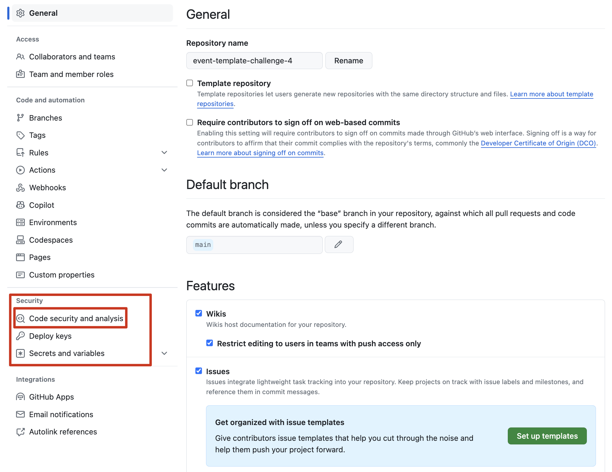
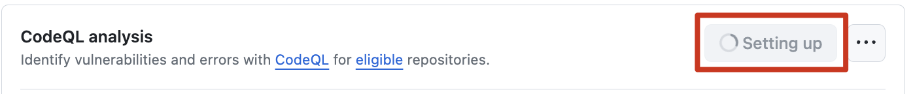
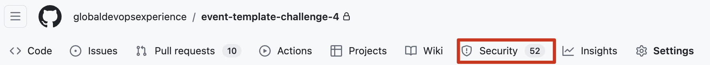
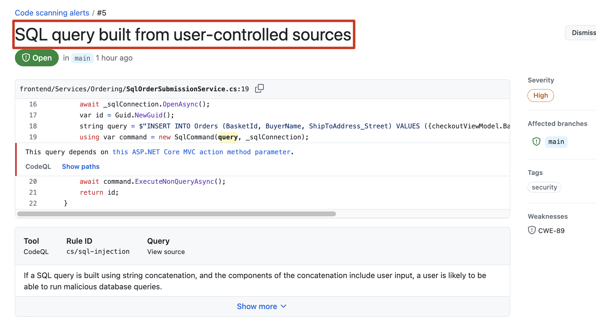
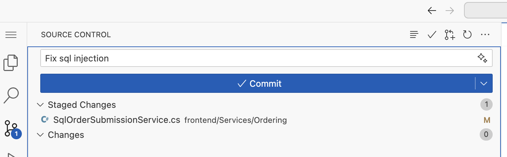
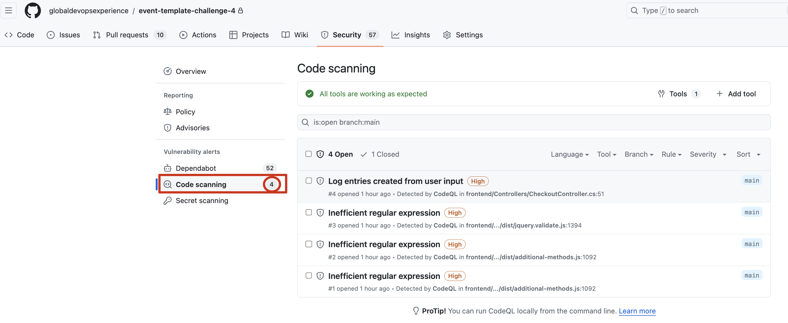

# Challenge 4 - Step - by - Step

## Introduction

GitHub Advanced Security helps teams to improve the security of their codebases with features like code scanning, secret scanning, and dependency review. This manual will guide you through the steps to enable and configure these features.

## Prerequisites
- Admin access to the organization or repository settings.

## Enabling GitHub Advanced Security
1. Go to your repository settings.

2. Navigate to the `Security` tab.

3. Enable Advanced Security.

4. Customize and commit your dependabot.yml

5. Choose the following two ecosystems and add them to your dependabot.yml

6. Your dependabot.yml should now look like this

Ps: See the different intervals (frontend packages change more frequently) 

7. GitHub Advanced Security

When you enable GHAS you get the following prompt:

Click on enable.

8. Configure secret scanning and check other settings:

9. Setup code scanning:

This may take a while:

10. Enable push protection

11. Navigate to the Security tab:

And check the alerts:

Have a look at the pr's generated and fix from top to bottom starting with critical to high, etc.

Have a look at the code scanning:

12. Fix SQL injection in a codespaces using CoPilot

Spin up a codespace and use CoPilot.

13. Export your SBOM and save the file as sbom.json. Create a folder on the main branch called sbom and upload/merge it in there.

## Best practices for GitHub Advanced Security

1. Regularly review and update security policies
   - Ensure your security policies are updated regularly to reflect new threats and vulnerabilities. This includes reviewing the rules for 
     code scanning and updating them to catch emerging security issues.

2. Integrate security early in the development lifecycle
   - Shift security left by integrating GHAS features early in the development process. Encourage developers to use local scanning tools 
     that integrate with GitHub’s security features to catch issues before they reach the main branch.

3. Use branch protection rules
   - Apply branch protection rules to require pull request reviews and pass status checks before merging. This ensures that code scans and 
     checks must pass, thus preventing the introduction of known vulnerabilities into protected branches.

4. Automate security as part of CI/CD pipelines
   - Automate security scanning within your CI/CD pipelines to ensure that every build is automatically scanned for vulnerabilities. This 
     helps in identifying and mitigating risks before deployment.

5. Educate your team
   - Conduct regular training sessions on security best practices and the importance of security in coding. Educate your team about the 
     specific features of GHAS and how they can use them effectively.

6. Regularly audit access controls
   - Periodically review who has access to your repositories and ensure that only necessary personnel have admin rights. Tighten access 
     controls to minimize risks from insider threats.

7. Monitor and act on security alerts
   - Regularly monitor the security alerts generated by GitHub and act on them promptly. Set up notifications to ensure the right team 
     members are informed of potential issues as soon as they are detected.

8. Leverage secret scanning to protect sensitive information
   - Use GHAS’s secret scanning to detect and prevent the exposure of secrets like API keys and credentials. This helps prevent accidental 
     leaks that could lead to serious security breaches.

9. Enable Dependabot alerts and security updates
   - Make full use of Dependabot to keep your dependencies up-to-date and secure from vulnerabilities. Configure Dependabot to automatically 
     open pull requests for critical security updates.

10. Adopt a response plan for security incidents
    - Have a clear, documented plan in place for responding to security incidents. Ensure that your team knows how to react when security 
      issues are detected, including who to contact and what steps to follow.

11. Review and refine security features regularly
    - Continuously review the effectiveness of your security measures. Adapt and refine your use of GHAS features based on new security 
      trends and the evolving needs of your projects.

12. Use CodeQL for advanced code scanning
    - Utilize GitHub’s CodeQL for deep semantic code analysis to identify complex vulnerabilities that other tools might miss. Customize 
      CodeQL queries to suit specific security needs of your application.

## Documentation
For more detailed information on GitHub Advanced Security, visit the [GitHub Advanced Security documentation](https://docs.github.com/en/code-security).

## Conclusion
By following this manual, your team can leverage GitHub Advanced Security to protect your projects effectively. Stay vigilant and regularly update your security settings.

