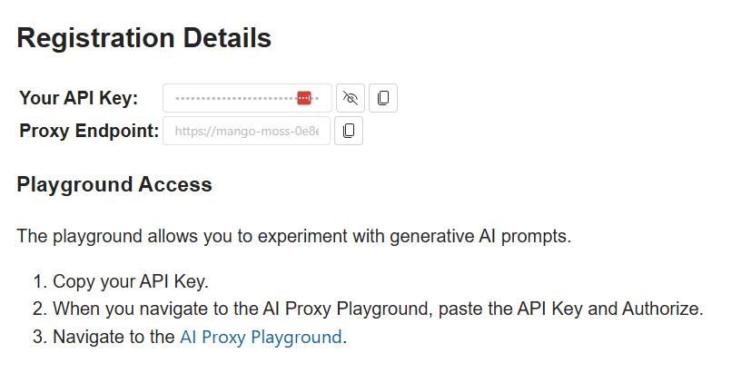
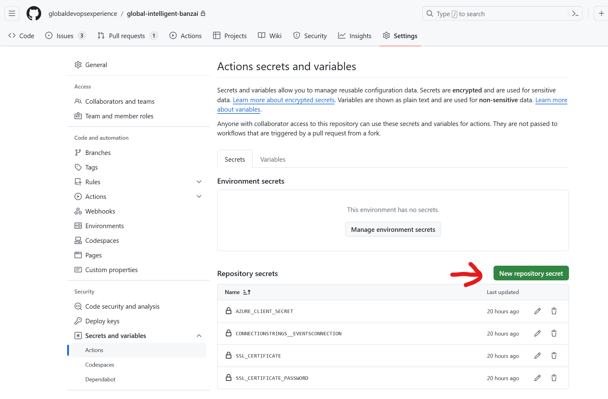
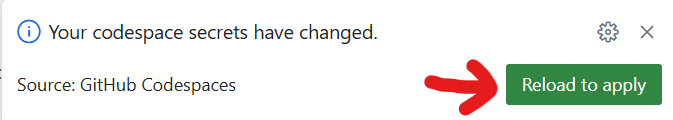

# 挑戰 5 - 步驟指南

## 介紹

## 先決條件
我創建了一個需要接受的拉取請求。只需接受它，它將為解決方案提供起點。

## 獲取 Open AI 的正確憑據

要從 Azure OpenAI 獲取令牌，我們使用我們自己的中央代理位於 https://openai.globoticket.com/event/2bbe-5922。您可以訪問它並使用您的 GitHub 帳戶進行身份驗證。右上角有“Login in with GitHub”按鈕。註冊後，您可以向下滾動並找到用於連接到我們的 API 的 URL 和 API 令牌：


然後，您需要複製 API 密鑰，並將其放入 Codespace 環境變量 OPENAIKEY 中。這是通過在存儲庫設置中創建一個新的存儲庫機密來完成的，如下圖所示：



保存變量後，您將在您的 codespace 中看到以下彈出窗口：



確保您點擊重載並應用，以便您在工作環境中擁有該機密。 不要擔心，重載不會丟失任何數據，codespace 會重新啟動，並且您在重啟前的一切都可用。

> 注意：您可以通過輸入以下命令從命令行運行應用程序： `dotnet run eventImporter.csproj` 這將在控制台中顯示結果的輸出。

## 文件分塊
由於 LLM 的處理 token 數量有限，我們需要確保提供的數據塊不會產生超過模型能處理的 token 數量。正如您在 [Duncan 的博客文章](https://roosma.dev/p/parsing-unstructured-data-with-semantic-kernel/) 中所讀到的，不同模型有不同的 token 限制。這已經在 `Chunk` 方法中實現，因此這裡不需要做任何操作。

## 解析分塊
這是在 `ParseEvent` 方法中完成的。這是您實現 Semantic Kernel 實現以接收數據塊並輸出 `CreateEventRequest` 記錄的地方。

我們將使用 Semantic Kernel 函數 `GetChatMessageContentAsync`。此函數需要我們提供的聊天歷史記錄，以及我們創建的設置和內核。

內核在創建此類時提供給我們，並作為變量 `_kernel` 可用。

我們需要創建設置，為此我們使用 `OpenAIPromptExecutionSettings` 類並使用 `ToolcallBehavior` 枚舉和值 `AutoInvokeKernelFunctions` 初始化它。這應如下所示：

```csharp
private async Task<CreateEventRequest> ParseEvent(string text)
{
     var settings = new OpenAIPromptExecutionSettings {ToolCallBehavior = ToolCallBehavior.AutoInvokeKernelFunctions};
}
```

接下來，我們調用 _chatCompletionService 的 GetChatMessageContentAsync 函數

這看起來如下：

```csharp
   var result = await _chatCompletionService.GetChatMessageContentAsync(history, settings, _kernel);
```

最後，我們將 JSON 字符串解析回返回對象並返回它。

該函數現在應如下所示：

```csharp
private async Task<CreateEventRequest> ParseEvent(string text)
{
        var settings = new OpenAIPromptExecutionSettings {ToolCallBehavior = ToolCallBehavior.AutoInvokeKernelFunctions};
        var result = await _chatCompletionService.GetChatMessageContentAsync(history, settings, _kernel);

        var parsedResult = JsonSerializer.Deserialize<Event>(result.ToString());
        return parsedResult.AsEvent();
}

```

## 創建聊天歷史記錄
現在我們需要提供傳遞給 GetChatMessageContentAsync 函數的歷史記錄的值。

我們使用聊天歷史記錄，因為這是一種提供更確定性結果的方法。我們向 LLM 提供我們過去交互的上下文。這為 LLM 提供了足夠的上下文來一次又一次地執行相同的操作，但現在使用不同的文本。

這裡的概念是我們模擬與 LLM 的通信，就像我們使用 Copilot 一樣。

這裡的主要區別在於我們還可以向 LLM 提供所謂的系統提示。此系統提示指示 LLM 根據它將接收的輸入為我們執行的預期操作。

這個經過驗證並且有效的示例的系統提示如下：

```
You are tasked with converting a user's description of a music event into a structured JSON format.
Only the description provided in the latest user input should be processed into the output. Ignore all previous interactions and outputs.
Follow this template:
{
    "Artist": {
        "Name": "extracted artist name",
        "Genre": "extracted genre, if available",
    },
    "Name": "extracted event name",
    "Venue": "extracted event location",
    "Date": "date in YYYY-MM-DD format",
    "Description": "concise event description",
    "Price": extracted price as integer converted to dollar
}

```

我們將此文本放入我們用來初始化 ChatMessageContent 對象的字符串中

由於我們在 JSON 輸出格式中使用了 " 字符，因此我們需要在創建的字符串中對其進行轉義。

初始化如下所示：

```csharp
new(AuthorRole.System,
    """
    You are tasked with converting a user's description of a music event into a structured JSON format.
    Only the description provided in the latest user input should be processed into the output. Ignore all previous interactions and outputs.
    Follow this template:
    {
        "Artist": {
            "Name": "extracted artist name",
            "Genre": "extracted genre, if available",
        },
        "Name": "extracted event name",
        "Venue": "extracted event location",
        "Date": "date in YYYY-MM-DD format",
        "Description": "concise event description",
        "Price": extracted price as integer converted to dollar
    }
    """)
```

您會看到我們為其提供了角色，System，這表明它是系統提示。

接下來，我們提供了用戶在對話中給出的文本，我們將其角色設置為用戶。這看起來如下：

```csharp
new(AuthorRole.User,
    $"""
     In the heart of the city's pulse, on the imminent 10th of September, 2024, amidst the hollowed grounds of Soldier Field under the mesmerizing guise of midnight, there unfolds an ethereal spectacle - 'Nightfall Nexus', an impeccable cosmic symphony crafted by none other than the celestial artisan, Earth Wind & Fire, for the privileged witnesses able to spare a sum of $121.
     """)
```

現在我們將給定的響應告訴代理應該給出的響應。這是一種多次提示，我們自己提供第一次問題的答案作為示例。LLM 將使用這一點，然後基於前一次交互的學習結果輸出後續請求。

響應也是一個 ChatMessageContent 對象，這次它是代理角色。

此對話的完整初始化如下所示：


現在我們將給定的響應告訴代理應該給出的響應。這是一種多次提示，我們自己提供第一次問題的答案作為示例。LLM 將使用這一點，然後基於前一次交互的學習結果輸出後續請求。

響應也是一個 ChatMessageContent 對象，這次它是代理角色。

此對話的完整初始化如下所示：

```csharp
var history = new ChatHistory
              {
                  new(AuthorRole.System,
                      """
                      You are tasked with converting a user's description of a music event into a structured JSON format.
                      Only the description provided in the latest user input should be processed into the output. Ignore all previous interactions and outputs.
                      Follow this template:
                      {
                          "Artist": {
                              "Name": "extracted artist name",
                              "Genre": "extracted genre, if available",
                          },
                          "Name": "extracted event name",
                          "Venue": "extracted event location",
                          "Date": "date in YYYY-MM-DD format",
                          "Description": "concise event description",
                          "Price": extracted price as integer converted to dollar
                      }
                      """),
                  new(AuthorRole.User,
                      $"""
                       In the heart of the city's pulse, on the imminent 10th of September, 2024, amidst the hollowed grounds of Soldier Field under the mesmerizing guise of midnight, there unfolds an ethereal spectacle - 'Nightfall Nexus', an impeccable cosmic symphony crafted by none other than the celestial artisan, Earth Wind & Fire, for the privileged witnesses able to spare a sum of $121.
                       """),
                  new(AuthorRole.Assistant,
                      $$"""
                        {
                            "Artist": {
                                "Name": "Earth Wind & Fire",
                                "Genre": null
                            },
                            "Name": "Nightfall Nexus",
                            "Venue": "Soldier Field",
                            "Date": "2024-09-10",
                            "Description": "an impeccable cosmic symphony crafted by none other than the celestial artisan, Earth Wind & Fire",
                            "Price": 121
                        }
                        """),
                  new(AuthorRole.User,
                      $"""
                      {text}
                      """)
              };

```

您看到最後一步是創建一個包含我們提供的文本的 ChatMessageContent 對象，這是我們作為函數輸入的數據塊。

## 如果時間允許：修復插件
現在代碼使用一個插件，該插件由 Kernel 自動調用，根據事實，它會收到一個票價不是以美元計算的事件。在提示中，我們指定我們希望輸出始終包含美元價格，這不是 LLM 可以提供的。美元的價值是波動的，需要從某個知道兌換比例的位置查詢。

CurrencyPlugin 類包含創建插件的標準方式。我們需要做的是向 Kernel 提供足夠的信息，使其知道可以調用此函數來獲取其他指定貨幣的美元值和該貨幣的 ISO 代碼。這為 Semantic Kernel 提供了足夠的信息，使其在需要將貨幣兌換為美元時調用該函數。

您可以看到當前的實現包含以下內容：

```cssharp
  private class CurrencyPlugin
  {
      [KernelFunction,
       Description("Currency amount and returns a random amount in USD")]
      [return:Description("A dollar equivalent of the provided currency amount")]
      public static int ConvertToDollar([Description("The ISO 4217 currency code")] string currencyCode,
                                            [Description("The amount of money to convert")]
                                            decimal amount)
      {
          return 100;
      }
  }

```

現在，您可以實現一個函數，該函數將接收該貨幣符號並查詢例如基於美元的匯率，以便您可以使用匯率進行金額轉換。您可以使用例如公共服務來實現這一點。您可以使用以下服務進行實驗：https://freecurrencyapi.com/

> 注意：他們的 API 文檔非常完善，可以在這裡找到：https://github.com/everapihq/freecurrencyapi-dotnet

您也可以在 Copilot 聊天中詢問如何使用例如以下提示來實現對此類 API 的調用：

呼叫 freecurrencyapi.com 將傳入的貨幣代碼和金額轉換為正確的美元金額。

## 總結
- 您學習了如何使用語義內核將 LLM 用於軟件中執行人類或需要大量工作才能完成的任務，因為數據是非結構化的。
- 您了解了語義內核的基本設置以及如何使用此庫將 LLM 合併到軟件中。
- 您了解了如何編寫在 LLM 無法提供正確數據或操作時調用的插件。您可以編寫任何可以調用的函數。
