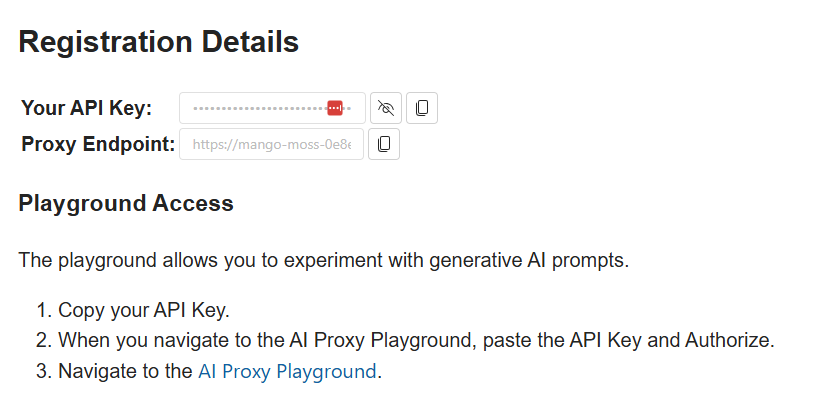

# Challenge 5 - Step - by - Step

## Introduction

## Prerequisites
I created a Pull request that you need to accept. Simply accept it and it will give you the starting point of the solution.

## Getting the correct credentials for Open AI

To get a token from Azure OpenAI we use our own central proxy at https://openai.globoticket.com/event/2bbe-5922. You can go to it and authenticate with your GitHub Account. The 'Login in with GitHub' is on the top right. After registering you can scroll down and find the url and API token you can use to connect to our API: 
 

The you need to copy the API key and put this in the code space environment variable OPENAIKEY. This is done by creating a new repository secret in the settings of the repo as shown in the below image. 


After saving the variable, you will see the following pop-up apear in your code space


make sure you click the reload and apply, so you have the secret in your working environment.
Don't worry, the reload will not lose any data, the codespace will restart and you have everything available as it was before the restart.

> Note: You can run the application from the command-line by typing:
`dotnet run eventImporter.csproj`
This will show you the output of the results in the console.


## Chunking the files
Because LLMs have a limited amount of tokens they can process, we need to ensure that the chunk of data we provide does not crete more tokens than can be processed by the model. As you could read in [Duncans Blogpost](https://roosma.dev/p/parsing-unstructured-data-with-semantic-kernel/) different models have different token limits. This is implemented in the `Chunk` method and is already implemented for you, so nothing to do there.

## Parsing the Chunks
This is done in the method `ParseEvent`
This is where you implement the Semantic Kernel implementation to take in the chunk and output the `CreateEventRequest` record.

We are going to use the Semantic Kernel function `GetChatMessageContentAsync`. This function requires a chat history that we need to provide and the settings and the kernel that we created.

The Kernel is provided to us in the creation of this class and is available as variable with the name `_kernel`.

We need to create the settings and for this we use the class `OpenAIPromptExecutionSettings` and initialize it with the enumeration of `ToolcallBehavior`and the value `AutoInvokeKernelFunctions`. this should look as follows:

``` c#
private async Task<CreateEventRequest> ParseEvent(string text)
{
     var settings = new OpenAIPromptExecutionSettings {ToolCallBehavior = ToolCallBehavior.AutoInvokeKernelFunctions};
}
```
Next we call the `_chatCompletionService` with the function `GetChatMessageContentAsync`

 this looks as follows:
```c#
   var result = await _chatCompletionService.GetChatMessageContentAsync(history, settings, _kernel);
```

and finaly we parse the JSON string back to the return object and return it.

the function should now look like the following:
```c#
private async Task<CreateEventRequest> ParseEvent(string text)
{
        var settings = new OpenAIPromptExecutionSettings {ToolCallBehavior = ToolCallBehavior.AutoInvokeKernelFunctions};
        var result = await _chatCompletionService.GetChatMessageContentAsync(history, settings, _kernel);

        var parsedResult = JsonSerializer.Deserialize<Event>(result.ToString());
        return parsedResult.AsEvent();
}
```
### Creating the chat history
Now we need to provide the value for the history that we pass into the `GetChatMessageContentAsync` function.

We are using chat history, because this is a way to provide a more deterministic result. We provide the LLM with the context of what interactions we had in the past. this gives enough context for the LLM to do the same thing over and over again, but now with different text.

The concept here is that we simulate a communication with the LLM, like we did with Copilot.

The big difference here is that we can also provide a so called System prompt to the LLM. This system prompt instructs the LLM what we expect it to do for us base don the input it will recieve.

the system prompt for this example, that has been validated and works, is the following:

```text
You are tasked with converting a user's description of a music event into a structured JSON format.
Only the description provided in the latest user input should be processed into the output. Ignore all previous interactions and outputs.
Follow this template:
{
    "Artist": {
        "Name": "extracted artist name",
        "Genre": "extracted genre, if available",
    },
    "Name": "extracted event name",
    "Venue": "extracted event location",
    "Date": "date in YYYY-MM-DD format",
    "Description": "concise event description",
    "Price": extracted price as integer converted to dollar
}
```
 We put this text into a string that we use to inititalize an object of type `ChatMessageContent`

Since we are using the " characters in the JSON output format, we need to escape this in the string we create.

The initialization looks as follwos:

```c#
new(AuthorRole.System,
    """
    You are tasked with converting a user's description of a music event into a structured JSON format.
    Only the description provided in the latest user input should be processed into the output. Ignore all previous interactions and outputs.
    Follow this template:
    {
        "Artist": {
            "Name": "extracted artist name",
            "Genre": "extracted genre, if available",
        },
        "Name": "extracted event name",
        "Venue": "extracted event location",
        "Date": "date in YYYY-MM-DD format",
        "Description": "concise event description",
        "Price": extracted price as integer converted to dollar
    }
    """)
```
You see we provide it the Role, System, which indicates it is the system prompt.

Next we provide it the text a user would have given in a conversation and we give this the Role, User. This looks as follows:

```c#
new(AuthorRole.User,
    $"""
     In the heart of the city's pulse, on the imminent 10th of September, 2024, amidst the hollowed grounds of Soldier Field under the mesmerizing guise of midnight, there unfolds an ethereal spectacle - 'Nightfall Nexus', an impeccable cosmic symphony crafted by none other than the celestial artisan, Earth Wind & Fire, for the privileged witnesses able to spare a sum of $121.
     """)
```
Now we are ging to give the reponse we tell the agent should have given us. This is a form of multi shot prompting, where you provide the answser to the first question yourself as an example. The LLM will use this and then will output subsequent requests based on the learnings from the previous interaction of a question and a response.

The reponse is also a `ChatMessageContent` object, and this time it is in the role of Agent. 

The full initialization of this conversation looks as follows:

```c#
var history = new ChatHistory
              {
                  new(AuthorRole.System,
                      """
                      You are tasked with converting a user's description of a music event into a structured JSON format.
                      Only the description provided in the latest user input should be processed into the output. Ignore all previous interactions and outputs.
                      Follow this template:
                      {
                          "Artist": {
                              "Name": "extracted artist name",
                              "Genre": "extracted genre, if available",
                          },
                          "Name": "extracted event name",
                          "Venue": "extracted event location",
                          "Date": "date in YYYY-MM-DD format",
                          "Description": "concise event description",
                          "Price": extracted price as integer converted to dollar
                      }
                      """),
                  new(AuthorRole.User,
                      $"""
                       In the heart of the city's pulse, on the imminent 10th of September, 2024, amidst the hollowed grounds of Soldier Field under the mesmerizing guise of midnight, there unfolds an ethereal spectacle - 'Nightfall Nexus', an impeccable cosmic symphony crafted by none other than the celestial artisan, Earth Wind & Fire, for the privileged witnesses able to spare a sum of $121.
                       """),
                  new(AuthorRole.Assistant,
                      $$"""
                        {
                            "Artist": {
                                "Name": "Earth Wind & Fire",
                                "Genre": null
                            },
                            "Name": "Nightfall Nexus",
                            "Venue": "Soldier Field",
                            "Date": "2024-09-10",
                            "Description": "an impeccable cosmic symphony crafted by none other than the celestial artisan, Earth Wind & Fire",
                            "Price": 121
                        }
                        """),
                  new(AuthorRole.User,
                      $"""
                       {text}
                       """)
              };
```
You see here that the last step is to create a ChatMessageContent object that now contains the text that we are providing, which is the chunk we got as input of the function.

## If Time Permits: Fixing the PlugIn
The code now uses a PlugIn that gets called automaticaly by the Kernel, based on the fact that it gets events with a ticket price that is not in USD. In the prompt we specified we want the output to always contain the price in USD, and this is not somethign the LLM can provide. The value of the USD is volatile and needs to be requested from some location that knows the conversion ratio.

The class `CurrencyPlugin` contains the the standard way to create plugins. Wat we need to do is provide the Kernel with enough information that it knows it can call this function to get the USD value of another value it specifies and the ISO code for that curency. this gives enough information to the Semantic Kernel to invoke the function the moment it needs to convert a valuta to USD.

You can see the current implementation contains the following:
```c#
  private class CurrencyPlugin
  {
      [KernelFunction,
       Description("Currency amount and returns a random amount in USD")]
      [return:Description("A dollar equivalent of the provided currency amount")]
      public static int ConvertToDollar([Description("The ISO 4217 currency code")] string currencyCode,
                                            [Description("The amount of money to convert")]
                                            decimal amount)
      {
          return 100;
      }
  }
```
Now you can implement a function that would take this currency symbol and look up the exchange rate e.g. based on USD, so you can convert the amount with the exchange rate. You can use e.g. a public service for this. You can experiment with a service like: https://freecurrencyapi.com/
>note: they have their API pretty well documented over here: https://github.com/everapihq/freecurrencyapi-dotnet


You can also ask Copilot chat how you can implement a call to such an API by using e.g. the following prompt in Copilot chat while you are with the cursor in the fucntion:
```text
call freecurrencyapi.com to convert the incoming currency code and amount into the right USD amount.
```

## Summary
- You touched on using semantic kernel to inccorporate the use of LLM's in your software to do tasks that normaly only humans can do or otherwise would cost insane amounts of work, since data is unstructured.
- You learned about the basic setup of Semantic Kernel and the way to incorporate LLM's in your software using this library
- You learned you can write plugins that get called when the LLM can not provide the right data or operation. You can write any function that can be called. 

