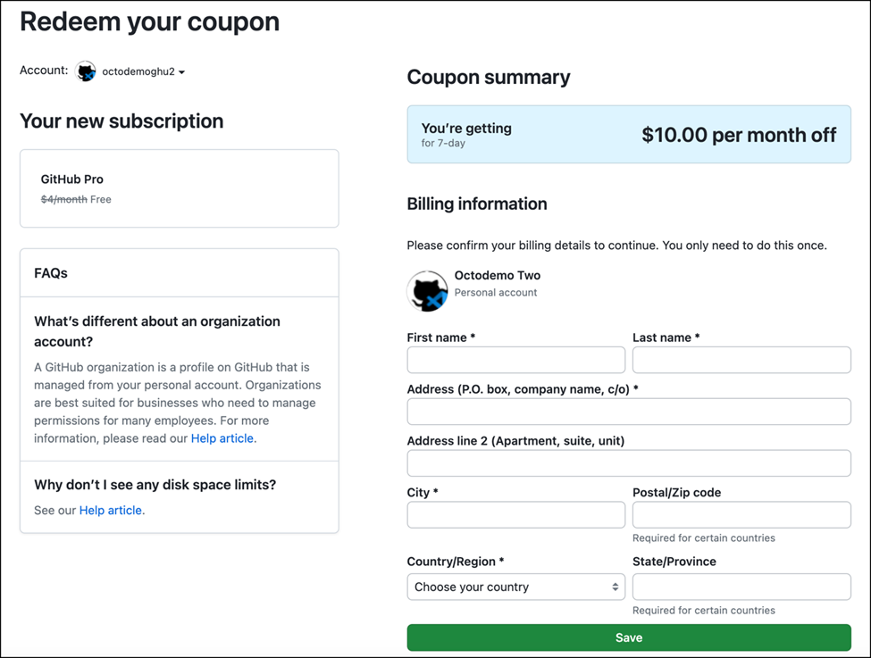
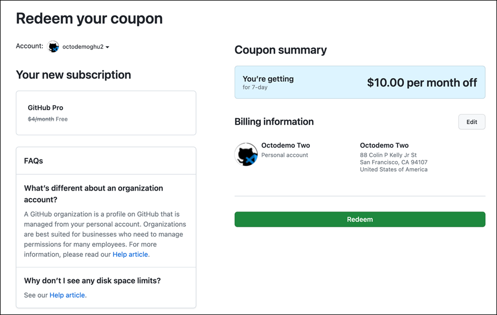
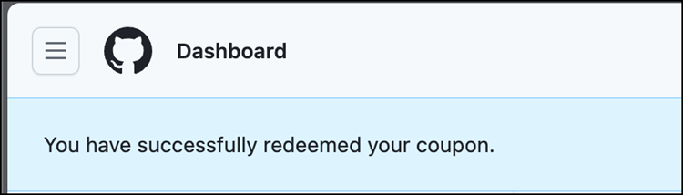
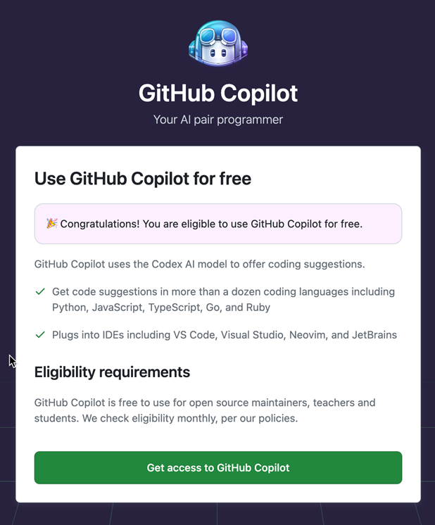
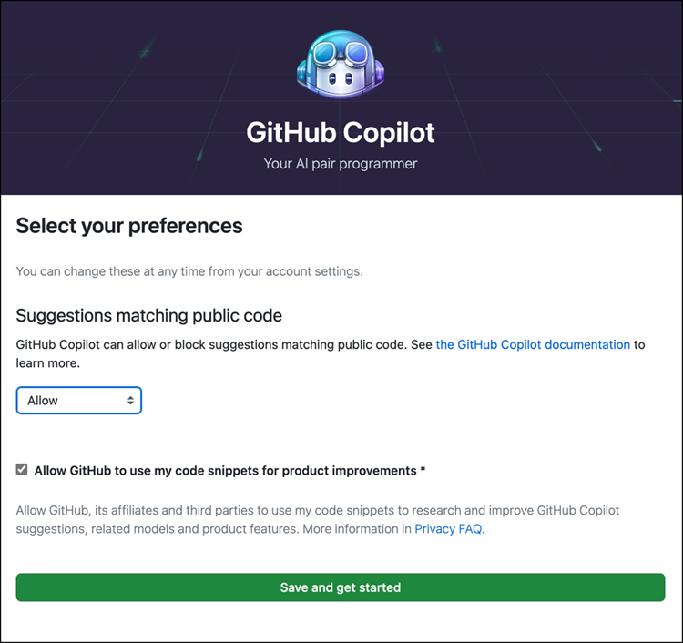
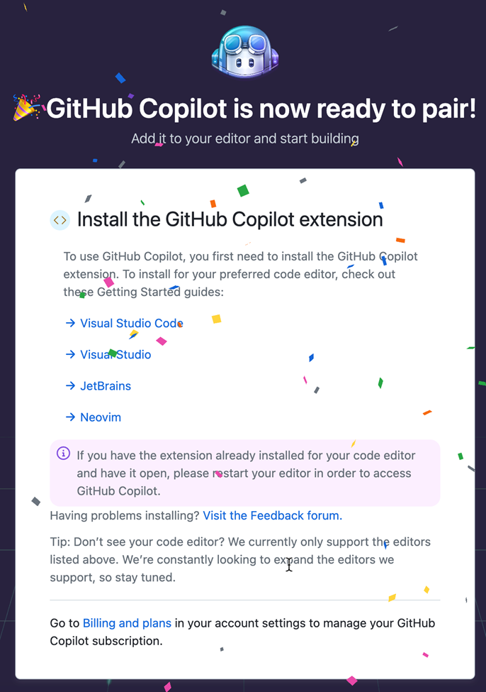

# 兌換你的 Copilot 優惠券

使用 Copilot 需要訂閱。由於我們不希望干擾公司現有的訂閱，我們創建了優惠券供您兌換。

請仔細按照以下步驟兌換您的 Copilot 試用訂閱。此優惠券可讓您使用 Copilot 7 天。

> [!WARNING]
> 如果您已有 Copilot 許可證，請勿使用此優惠券！否則您的當前許可證將被重置，且令牌在 7 天後停止工作。

## :shoe: 步驟 1
使用您在全球 DevOps 體驗期間要使用的 GitHub 用戶登錄 GitHub。

> 確認您已登錄，否則下一步將失敗且優惠券將失效！

## :triangular_flag_on_post: 步驟 2
- 瀏覽至 https://github.com/redeem/
- 在頁面上，填寫您的地址。它不會要求提供信用卡。

填寫所有必填字段並點擊保存。

接下來，您將看到兌換優惠券的選項。這應如下所示：
 

:point_up_2:點擊兌換。

## :construction_worker: 步驟 3
現在，您應該在 GitHub 儀表板上看到您已經可以使用 Copilot。

## :rotating_light: 步驟 4
現在瀏覽到以下位置：
https://github.com/github-copilot/free_signup 您應該看到您有資格使用 Copilot。這看起來像這樣：\

點擊“Get access to GitHub Copilot”按鈕

## :rocket: 步驟 5
配置 Copilot，使其不會將您的數據用於訓練模型。這是通過 **取消選擇** 選項 `Allow GitHub to use my code snippets for product improvements` 來完成的。

另一個重要的設置是您允許或不允許使用公共匹配代碼。如果您擔心可能會向您建議的 GPL 許可代碼，這可能會使您有義務發布自己的代碼，請取消此選擇。

:point_up_2: 點擊“Save and get started”

## 步驟 6 :tada: 您已完成並準備好使用 Copilot！

